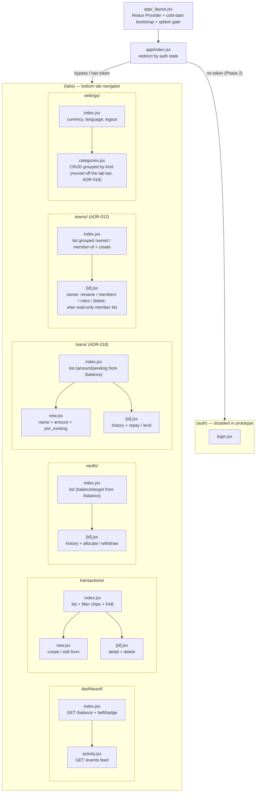
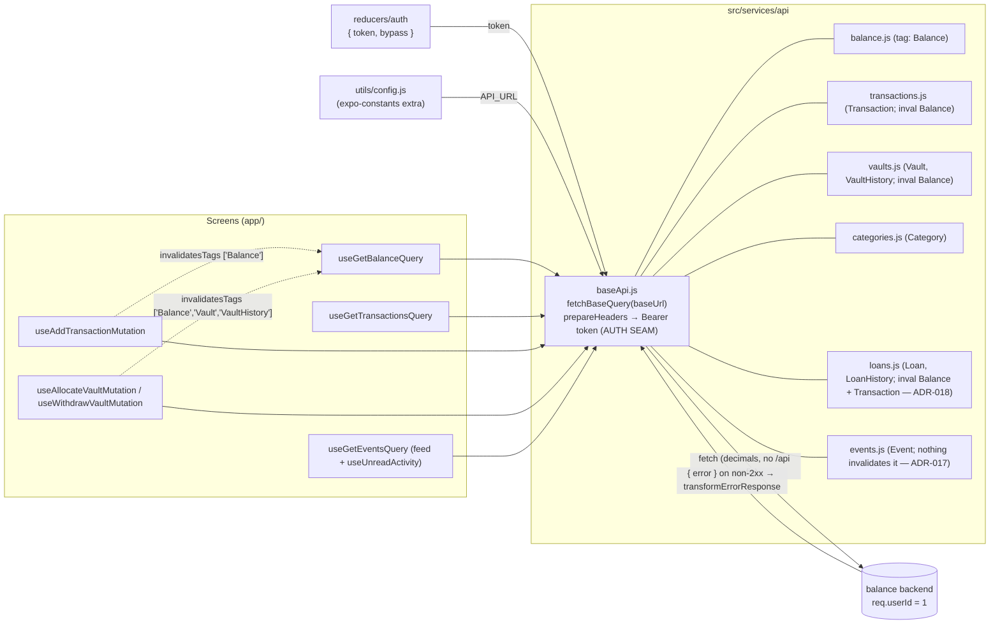
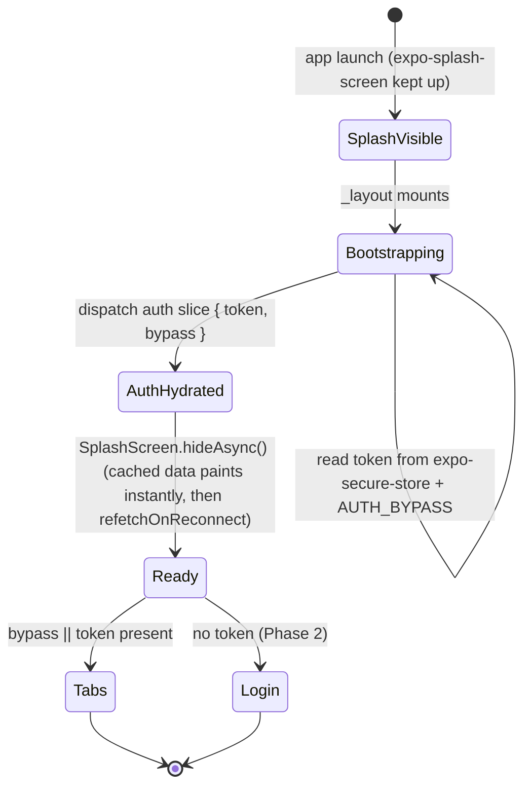

# ARCHITECTURE — `balance-mobile`

Graph-first mental model for the Expo client. Pairs with `CLAUDE.md` (file map detail), `PRD.md`
(product contract), and `.claude/ADR/` (decisions). Diagrams are the cheap way to load context — keep
them in sync as the app grows (doc drift is a bug).

## 1. Navigation graph (expo-router, ADR-004)



**RBAC (ADR-012).** Every financial screen gates its write affordances through one seam,
`src/permissions` (`usePermissions` → `{ canAdd, canEditRow(row), canManageTeam }`). The active role is
**derived** (never stored) by `useActiveRole` from the cached `GET /teams` (which now returns a per-team
`role`) + `activeTeamId`; `null` = personal = full access. `myUserId` (for member "own-row" checks) is
the JWT `sub` claim, decoded by `src/utils/jwt`. Guest = read-only; the backend enforces the same rules
and `403`s a violation (surfaced, not a logout).

**Theming (ADR-013).** Colors are **derived, never stored**, through one seam — `useTheme()`
(`src/hooks/useTheme.js`) → `{ colors, scheme, accent }`: the scheme comes from the persisted
`prefs.themeMode` (`system|light|dark`, System follows `useColorScheme()`), the **accent from the active
team's `color`** in the cached `GET /teams` (personal / no color → `DEFAULT_ACCENT`), and
`makeColors(scheme, accent)` (pure, `src/components/theme.js`) builds the palette with a
contrast-derived `primaryText`. Switching context re-tints the whole app (tab bar included) — that's
the context signal. There is no static `colors` export; components use
`const styles = makeStyles(colors)` factories (React Compiler memoizes).

## 2. Data flow — RTK Query (ADR-005)

Components call generated hooks only; the token is attached in exactly one place; mutations invalidate
tags so the dashboard re-fetches automatically.



**Cache tags:** `Balance`, `Transaction`, `Vault`, `VaultHistory`, `Loan`, `LoanHistory`,
`Category`, `Event`. Per-vault balances/targets and per-loan `amount`/`pending` figures come from
`GET /balance` (not `GET /vaults` / `GET /loans`), so any mutation that moves money invalidates
`Balance`; loan movements additionally invalidate `Transaction` because the backend writes
`loan_id` journal rows into the ledger (excluded from balance math and client totals — ADR-018). `Event` is the one tag nothing ever invalidates — `/events` is read-only,
append-only server history that no local mutation can know about, so feed freshness comes from the
app-wide `refetchOnMountOrArgChange` (on-focus refetch) plus pull-to-refresh, not cache invalidation
(ADR-017).

## 3. Cold-start / splash state (ADR-001, ADR-006)



## 4. Directory / file map

```
balance-manager/                 # app name: balance-mobile
├── app.config.js                # dotenv(.env.${APP_ENV}) → extra; expo-router; React Compiler
├── eas.json                     # development(dev-client) / preview(stage) / production
├── .env.dev .env.stage .env.prod   # API_URL, AUTH_BYPASS, APP_ENV   (gitignored)
├── index.js                     # expo-router entry
├── app/                         # ROUTES ONLY (expo-router's required root folder) — thin adapters
│   ├── _layout.jsx              # providers + cold-start bootstrap + splash gate (router infra)
│   ├── index.jsx                # boot redirect (router infra)
│   ├── (auth)/      _layout.jsx  login.jsx
│   └── (tabs)/      _layout.jsx
│        dashboard/{_layout,index,activity}.jsx   # index = GET /balance + bell/badge; activity = GET /events feed
│        transactions/{index,new,[id]}.jsx   vaults/{index,new,[id]}.jsx
│        loans/{_layout,index,new,[id]}.jsx       # lent-out money (ADR-018; took the categories tab slot)
│        settings/{_layout,index,categories}.jsx  # categories management now nests under settings
│        # each (tabs) screen file is a 1-line shim: `export { default } from '../../src/screens/X'`
├── src/                         # ALL real code lives here
│   ├── screens/                 # screen bodies (composition + data orchestration), mirrors team layout
│   │   ├── Dashboard/index.jsx   Activity/index.jsx   # feed screen (ADR-017)
│   │   ├── Transactions/{ListScreen,NewScreen,EditScreen}.jsx  TransactionForm.jsx
│   │   ├── Vaults/{ListScreen,NewScreen,DetailScreen}.jsx
│   │   ├── Loans/{ListScreen,NewScreen,DetailScreen}.jsx   # lent-out money (ADR-018)
│   │   ├── Teams/{ListScreen,ManageScreen}.jsx   # team management (ADR-012)
│   │   ├── Categories/index.jsx   Settings/index.jsx
│   ├── components/
│   │   ├── ui/                  # shared atoms/molecules — one file each + index.js barrel
│   │   │   └── {Screen,ScreenHeader,Card,Button,Field,Chip,ColorSwatchPicker,MoneyText,Typography,EmptyState,QueryBoundary}.jsx
│   │   └── theme.js             # light/dark palettes + makeColors(scheme, accent) + PRESET_TEAM_COLORS; spacing/radius/font (ADR-013)
│   ├── store/                   # configureStore + RTKQ middleware + redux-persist + setupListeners
│   ├── services/
│   │   ├── api/                 # baseApi.js + balance/transactions/vaults/loans/categories/events.js (injectEndpoints)
│   │   └── storage/             # secure.js (token), prefs.js (cache/prefs)
│   ├── reducers/{auth,context,prefs,activity}/  # auth (token/user), context (activeTeamId), prefs (themeMode — ADR-013), activity (per-context lastSeen — ADR-017)
│   ├── permissions/             # RBAC seam: usePermissions + pure can*() matrix (ADR-012)
│   ├── hooks/                   # useIdToken(), useActiveTeamId(), useActiveRole(), useTheme() (ADR-013), useUnreadActivity() (ADR-017)
│   ├── utils/                   # config.js, money.js, dates.js, jwt.js (decodeUser), colors.js (hex + contrast), activity.js (eventMessage/eventHref — ADR-017)
│   └── i18n/                    # i18next init + locales/{en-US,es-MX}.json
├── CLAUDE.md  PRD.md  ARCHITECTURE.md  README.md
└── .claude/ADR/   .claude/agents/plans/
```

> Native folders `android/` and `ios/` are intentionally **not** committed — they are regenerated by
> `npx expo prebuild` when the app moves to a dev build (ADR-003).
