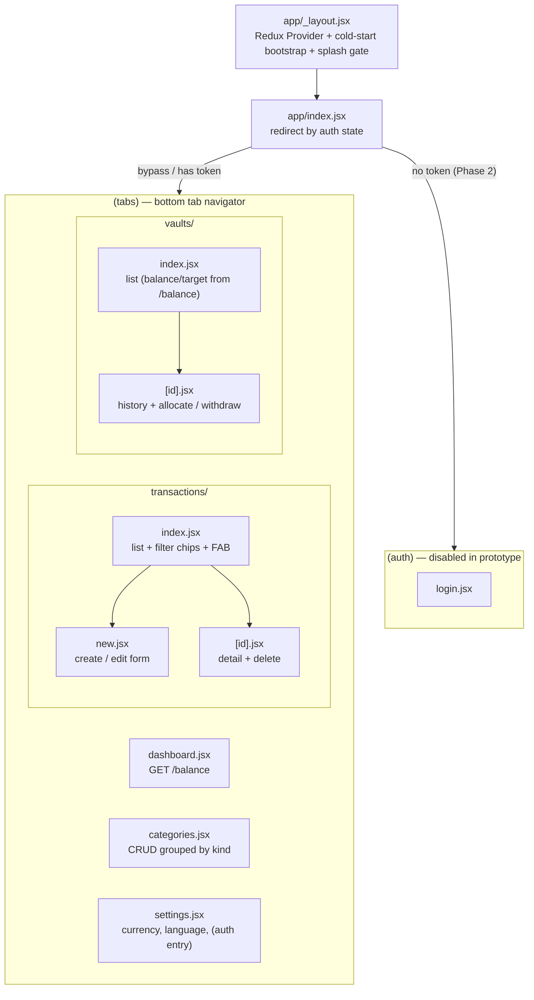
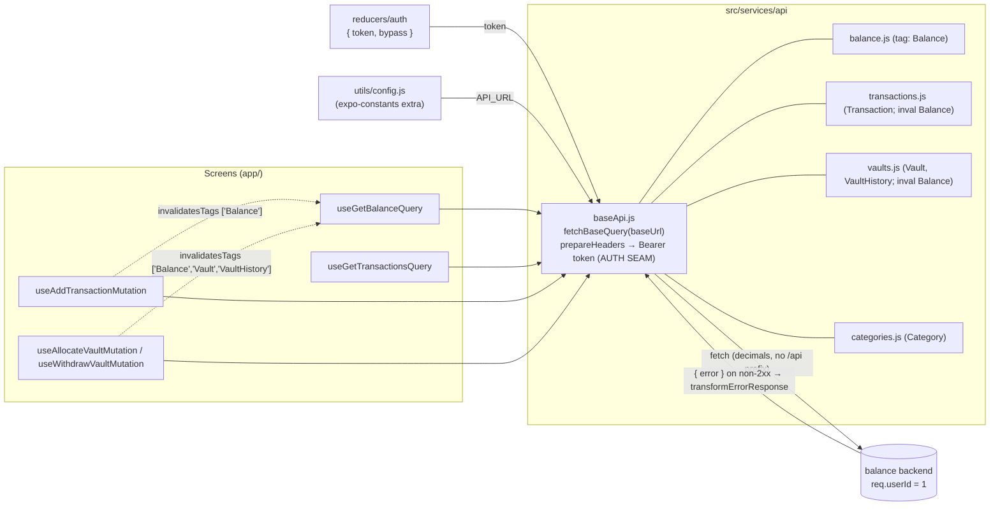
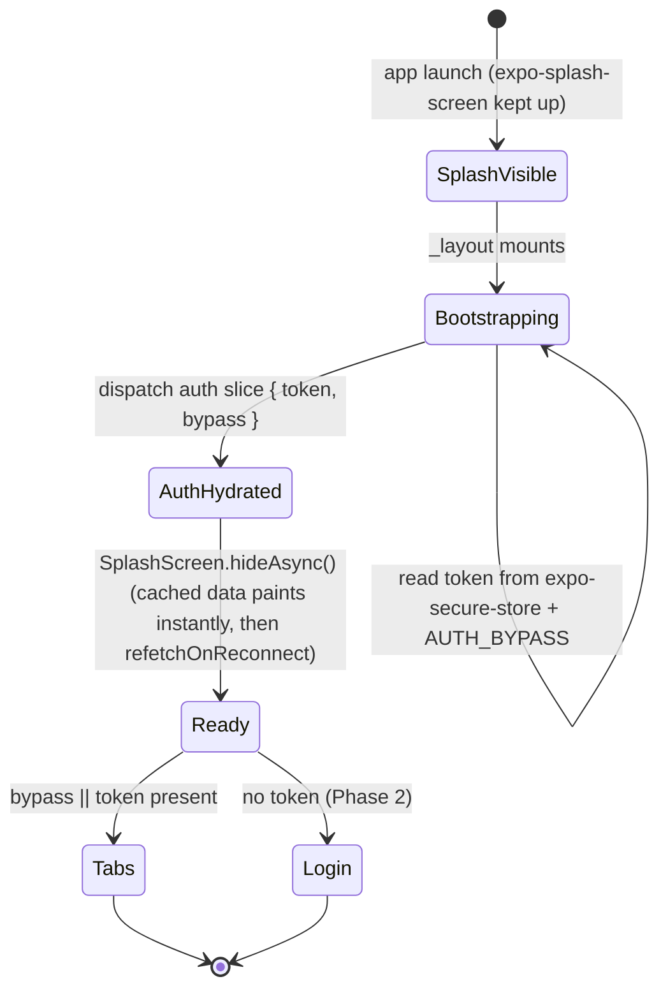

# ARCHITECTURE — `balance-mobile`

Graph-first mental model for the Expo client. Pairs with `CLAUDE.md` (file map detail), `PRD.md`
(product contract), and `.claude/ADR/` (decisions). Diagrams are the cheap way to load context — keep
them in sync as the app grows (doc drift is a bug).

## 1. Navigation graph (expo-router, ADR-004)



## 2. Data flow — RTK Query (ADR-005)

Components call generated hooks only; the token is attached in exactly one place; mutations invalidate
tags so the dashboard re-fetches automatically.



**Cache tags:** `Balance`, `Transaction`, `Vault`, `VaultHistory`, `Category`. Per-vault balances and
targets come from `GET /balance` (not `GET /vaults`), so any mutation that moves money invalidates
`Balance`.

## 3. Cold-start / splash state (ADR-001, ADR-006)



## 4. Directory / file map

```
balance-manager/                 # app name: balance-mobile
├── app.config.js                # dotenv(.env.${APP_ENV}) → extra; expo-router; React Compiler
├── eas.json                     # development(dev-client) / preview(stage) / production
├── .env.dev .env.stage .env.prod   # API_URL, AUTH_BYPASS, APP_ENV   (gitignored)
├── index.js                     # expo-router entry
├── app/                         # ROUTES ONLY (expo-router's required root folder) — thin adapters
│   ├── _layout.jsx              # providers + cold-start bootstrap + splash gate (router infra)
│   ├── index.jsx                # boot redirect (router infra)
│   ├── (auth)/      _layout.jsx  login.jsx
│   └── (tabs)/      _layout.jsx  dashboard.jsx  categories.jsx  settings.jsx
│        transactions/{index,new,[id]}.jsx   vaults/{index,new,[id]}.jsx
│        # each (tabs) screen file is a 1-line shim: `export { default } from '../../src/screens/X'`
├── src/                         # ALL real code lives here
│   ├── screens/                 # screen bodies (composition + data orchestration), mirrors team layout
│   │   ├── Dashboard/index.jsx
│   │   ├── Transactions/{ListScreen,NewScreen,EditScreen}.jsx  TransactionForm.jsx
│   │   ├── Vaults/{ListScreen,NewScreen,DetailScreen}.jsx
│   │   ├── Categories/index.jsx   Settings/index.jsx
│   ├── components/
│   │   ├── ui/                  # shared atoms/molecules — one file each + index.js barrel
│   │   │   └── {Screen,Card,Button,Field,Chip,MoneyText,Typography,EmptyState,QueryBoundary}.jsx
│   │   └── theme.js             # colors / spacing / radius / font
│   ├── store/                   # configureStore + RTKQ middleware + redux-persist + setupListeners
│   ├── services/
│   │   ├── api/                 # baseApi.js + balance/transactions/vaults/categories.js (injectEndpoints)
│   │   └── storage/             # secure.js (token), prefs.js (cache/prefs)
│   ├── reducers/auth/           # auth slice (token/bypass/user)
│   ├── hooks/                   # useIdToken(), shared data hooks
│   ├── utils/                   # config.js, money.js, dates.js
│   └── i18n/                    # i18next init + locales/{en-US,es-MX}.json
├── CLAUDE.md  PRD.md  ARCHITECTURE.md  README.md
└── .claude/ADR/   .claude/agents/plans/
```

> Native folders `android/` and `ios/` are intentionally **not** committed — they are regenerated by
> `npx expo prebuild` when the app moves to a dev build (ADR-003).
