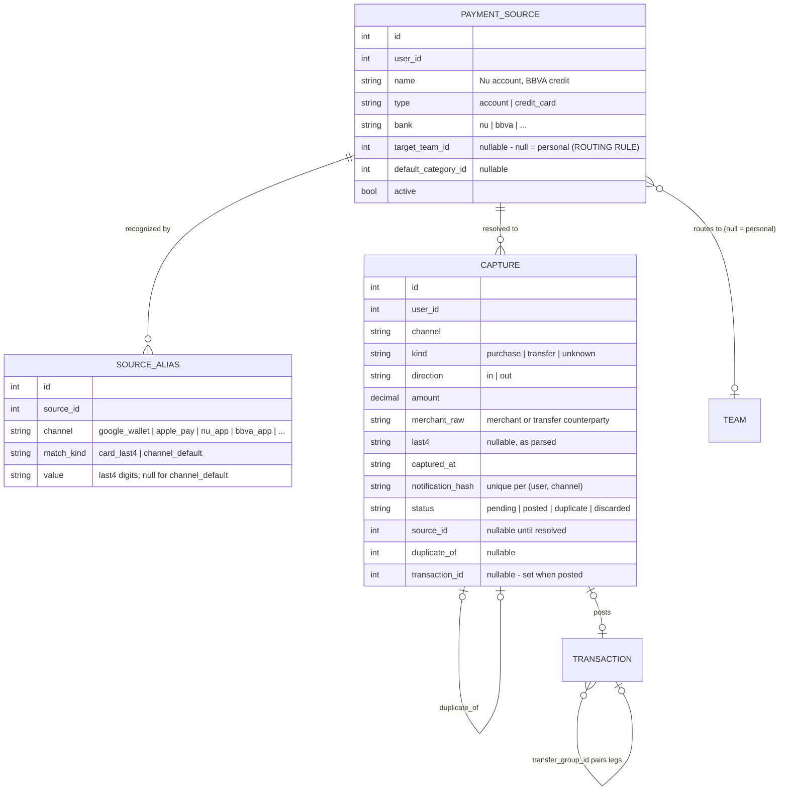

# Research — Automatic movement capture from card payments (Google Wallet / Apple Pay)

> **Status:** decided — see `.claude/ADR/ADR-014-auto-capture-domain-model.md` (§8 shipped as
> backend Slices 1+2 + the mobile surface; contract: backend `docs/react-native-auto-capture-update.md`).
> Authored 2026-07-02. Companion to `PRD.md` §9 (Phase 4 enhancements) and backend repo
> `/Users/jayro/Dev/Node/Projects/balance`.
> **Amended 2026-07-02 (design session):** §8 adds the **domain model** (payment sources, aliases,
> captures, dedup, per-source routing, cross-context transfers). It supersedes §5.5 and resolves
> several §7 open questions. The backend request derived from §8 lives in
> `docs/backend-auto-capture-request.md`.

## 1. Goal

When the user pays with a card via **Google Wallet** (Android) or **Apple Pay** (iOS), the movement
should land in `balance` as a transaction **automatically** — no manual entry. Today every expense is
typed by hand into the Transactions form (`POST /transactions`).

## 2. The hard constraint

**Neither wallet exposes a transaction-read API to third parties.**

- **Google Wallet API** is for *issuing* passes (cards, tickets, loyalty), not for reading the user's
  payment activity. There is no endpoint that returns "purchases made with cards in this wallet."
- **Apple Pay / PassKit** is the same: merchants can *accept* Apple Pay; apps cannot *read* the
  user's Wallet transaction history. The one exception (FinanceKit, §3.4) is entitlement-gated and
  covers only Apple's own products + UK open banking.

So every viable path is **indirect**: capture the *evidence* of the payment (a notification, an
automation trigger, a bank feed, an email) and turn it into a `POST /transactions`.

## 3. Options

### 3.1 iOS — Shortcuts "Transaction" personal automation ⭐ (best iOS option)

iOS 17+ ships a **Transaction trigger** in the Shortcuts app: a personal automation that fires when
selected Wallet cards are used (NFC tap; not browser payments). It can **Run Immediately** (no
confirmation) and exposes the **card, merchant, and amount** (amount arrives as text — strip
non-digits with a Replace Text action). Expense apps (TravelSpend, Skwad, MoneyCoach) already document
this exact pattern for their users.

**How it maps to `balance`:**

- A shortcut with **Get Contents of URL** → `POST {API_URL}/transactions` with
  `Authorization: Bearer <token>`, body `{ type: "expense", amount, description: merchant, occurred_at: today }`.
- **Zero app/native change. Works in Expo Go. Nothing to build besides the shortcut itself** (and
  optionally a long-lived token — see §5).
- Limitations: per-device manual setup (not distributable in-app), NFC-tap payments only, no
  category, amount parsing is string-based, and the trigger fires *at payment time* only (missed if
  the phone is off — rare for NFC).

Sources: [Apple Support — Transaction triggers in Shortcuts](https://support.apple.com/guide/shortcuts/transaction-trigger-apd65c67538a/ios),
[Graham Haley — Apple Pay automation](https://grahamhaley.co.uk/2024/11/19/apple-pay-automation/),
[TravelSpend setup guide](https://help.travel-spend.com/shortcuts--automation/ignQHsp85RQDsig2QwVcdX/set-up-apple-pay-automation/7tL8XfjBceg4D7mQeiSK2V),
[Skwad — transactions via iOS Shortcuts](https://skwad.app/blog/creating-skwad-transactions-using-ios-shortcuts).

### 3.2 Android — NotificationListenerService ⭐ (best Android option, needs dev build)

Android lets an app (with explicit user consent in system settings) read **all status-bar
notifications** via `NotificationListenerService`. Purchases via Google Wallet / the bank's app
produce a notification ("You paid $X at Y"); the listener parses it and posts a transaction. This is
the established pattern for auto-expense trackers (Alkemi, FinArt, and open-source examples), and it
deliberately avoids `READ_SMS` — Google Play heavily restricts SMS permissions, while the
notification-listener permission is user-granted and review-safe.

**How it maps to `balance-mobile`:**

- Requires a **native module** (e.g. `react-native-android-notification-listener` or a small custom
  Expo module) → **breaks the Expo Go constraint (ADR-003)**. This is the first feature that
  genuinely forces `npx expo prebuild` + a dev build. ADR-003 anticipated this as "a config step,
  not a rewrite"; signing/build scripts already exist (`scripts/build-android*.sh`).
- Needs **per-bank/per-app notification parsers** (regex per issuer format) — brittle but locally
  fixable; parse on-device, send only the structured result (privacy-friendly).
- A headless JS task (or queued outbox) posts `POST /transactions`; if offline, this dovetails with
  the ADR-007 Phase-3 outbox north star.
- Android-only; iOS forbids notification listening outright.

Sources: [Android developers — NotificationListenerService](https://developer.android.com/reference/android/service/notification/NotificationListenerService),
[open-source notification-based expense tracker](https://github.com/atick-faisal/Expense-Tracker-Android),
[Alkemi (reads Google Pay/bank notifications)](https://www.usealkemi.in/),
[privacy-first tracker without READ_SMS](https://medium.com/@owinojumahjerome/how-i-built-a-privacy-first-auto-expense-tracker-in-flutter-without-the-read-sms-api-6c7c66d56af5).

### 3.3 Android — no-code bridge (Tasker / MacroDroid) — interim, zero app change

Same notification-capture idea, but done by an automation app the user configures: MacroDroid/Tasker
watches Wallet/bank notifications and fires an **HTTP POST** to the API. Mirrors the iOS Shortcuts
path: nothing to build in the app, per-device setup, fine for a personal POC while the native
listener waits for the dev build. Costs nothing to "support" beyond the same ingest considerations
in §5.

### 3.4 Apple FinanceKit — official but not viable here

FinanceKit (iOS 17.4+/18.4) gives third-party apps **read access to Wallet financial data with user
consent** — but only **Apple Card / Apple Cash / Apple Savings** (US) and, since iOS 18.4, **UK open
banking** institutions. It requires a **per-bundle-ID entitlement granted by Apple** to a Developer
Program account. Arbitrary Visa/Mastercard credit cards added to Apple Pay are **not** covered.
Verdict: wrong geography (MX), wrong card coverage, entitlement friction. Revisit only if Apple
expands coverage. (A community `expo-finance-kit` module exists if it ever becomes relevant.)

Sources: [Apple — Get started with FinanceKit](https://developer.apple.com/financekit/),
[FinanceKit docs](https://developer.apple.com/documentation/FinanceKit),
[MacStories — FinanceKit opens Apple Card data](https://www.macstories.net/linked/financekit-opens-real-time-apple-card-apple-cash-and-apple-savings-transaction-data-to-third-party-apps/),
[Computerworld — What is FinanceKit](https://www.computerworld.com/article/1612346/what-is-financekit-in-ios-174.html).

### 3.5 Bank aggregators (open banking) — the reliability north star

Skip the wallet entirely and read the **card/bank account feed**: Plaid (US/CA/EU),
**Belvo / Finerio / Syncfy (Mexico + LatAm)**. A backend integration pulls settled transactions with
merchant, amount, and date, wallet-agnostic and cross-platform, including non-NFC payments.

- Pros: most complete and reliable capture; no per-device setup; catches web purchases.
- Cons: **backend work, not client work**; credential handling + webhooks; free tiers are limited and
  production pricing is real money; MX coverage must be verified per bank; transactions arrive
  settled (1–2 days later), not at tap time.
- Fit: north-star option once the project outgrows POC — record it in the ADR as the aim-high target
  even if the MVP ships the automation paths.

### 3.6 Low-tech fallbacks

- **Bank email alerts → parser**: backend ingests a forwarded alert mailbox (IMAP or an inbound-mail
  webhook) and parses per-bank templates. Cross-platform, no device setup, but brittle and needs an
  always-on ingest job.
- **CSV/statement import**: manual but batch; a `POST /transactions/import` would backfill history.
  Good companion regardless of which capture path wins (reconciliation).

## 4. Comparison

| Option | Platform | App change | Expo Go safe | Capture timing | Reliability | Effort |
|---|---|---|---|---|---|---|
| 3.1 Shortcuts Transaction trigger | iOS | none (backend token maybe) | ✅ | instant (NFC only) | high | **S** |
| 3.2 NotificationListenerService | Android | native module + parsers | ❌ dev build | instant | medium (regex per bank) | **M–L** |
| 3.3 Tasker/MacroDroid bridge | Android | none | ✅ | instant | medium | **S** (per device) |
| 3.4 FinanceKit | iOS | native + entitlement | ❌ | near-real-time | n/a — coverage excludes MX cards | blocked |
| 3.5 Aggregator (Belvo/Plaid) | both | backend integration | ✅ (client untouched) | settled (~1–2 d) | high | **L** + cost |
| 3.6 Email parsing / CSV | both | backend | ✅ | delayed / manual | low–medium | S–M |

## 5. What any path needs from the `balance` backend (feeds the ADR)

Whichever capture path wins, ingestion has shared requirements the ADR should decide on:

1. **An ingest surface.** Reuse `POST /transactions` (simplest — Shortcuts/Tasker can call it today)
   vs a dedicated `POST /transactions/ingest` with relaxed shape (raw merchant string, source tag).
2. **Auth for automations.** Shortcuts/Tasker need a **long-lived token or API key** — the current
   JWT expires and can't be refreshed by a shortcut. Options: per-device API key entity,
   long-TTL scoped token, or a signed webhook secret.
3. **Idempotency / dedup.** Notification + email + aggregator can all report the same payment;
   an ingest key (`source`, `external_ref`, or fuzzy match on amount+merchant+timestamp) prevents
   double-booking. Also protects against Shortcuts re-runs.
4. **Review state.** Auto-captured rows should arguably land as `pending` (uncategorized, editable)
   with an in-app "review inbox," since merchant strings ≠ categories. Alternatively a
   merchant→category mapping table that learns from user corrections.
5. **Team/context.** ~~Automations can't know the active team — auto-captured movements should default
   to **personal** context; moving one to a team is a manual edit (or a per-card rule later).~~
   **Superseded by §8:** the *source* (card/account) decides the context via a per-source routing
   rule, not the app's active context — see §8.2 `payment_sources.target_team_id`.

## 6. Suggested shape for the ADR (aim high, ship lean)

- **Phase A (ship lean, no app change):** document + template the **iOS Shortcuts automation** and an
  **Android MacroDroid macro** posting to the API; add the minimal backend affordances (long-lived
  token + dedup). Personal-context only.
- **Phase B (first dev-build feature):** in-app **Android notification listener** with per-bank
  parsers and a review inbox. This is the moment ADR-003's prebuild path gets exercised (and MMKV
  from ADR-006 can ride the same build).
- **North star:** **aggregator feed (Belvo)** on the backend for settled, complete, cross-platform
  capture; automations remain the instant-capture layer.

## 7. Open questions to resolve before writing the ADR

- Which bank(s)/issuer(s) actually need to be parsed, and what do their Android notifications /
  email alerts look like? (Determines parser effort and whether notifications even fire for the
  user's cards.)
- Long-lived token design: does the backend add an API-key entity, or a `?ttl=` login variant?
- ~~Does auto-capture create real transactions immediately or a pending/review state first?~~
  **Resolved in §8.3:** auto-post when alias → source → routing all resolve; `pending` inbox only
  for unknown sources / ambiguous dedup.
- Belvo (or Finerio/Syncfy) coverage + free-tier limits for the user's specific MX banks.
- ~~Where does dedup live — DB unique key on `(source, external_ref)` vs heuristic matching?~~
  **Resolved in §8.3:** both — a unique `notification_hash` per channel (exact re-delivery) plus a
  heuristic `(source_id, amount, direction, time-window)` match for cross-channel doubles.

## 8. Domain model — sources, aliases, captures, transfers (design session 2026-07-02)

> This section is the data model underneath whichever capture path from §3 wins. It answers the
> questions the capture options can't: which **context** an auto movement lands in, how the same
> physical card is recognized across **different apps' notifications**, how **duplicates** collapse,
> and how a **cross-context transfer** is represented. Backend contract:
> `docs/backend-auto-capture-request.md`.

### 8.1 Core insight

A notification is **not** a transaction — it is *evidence* that a payment happened, reported by one
channel. The same payment can produce N pieces of evidence (a Google Wallet tap notification **and**
the Nu app's own push for the same purchase). So the model needs an intermediate layer between
"notification arrived" and "transaction exists"; that layer is where identity resolution, dedup, and
routing happen.

Three concerns, kept separate:

1. **The instrument** (which pot of money paid) → `payment_sources`
2. **The channel** (which app reported it, and under what label) → `source_aliases`
3. **The routing** (which context the transaction lands in) → a rule on the source, **not** the
   app's active context (an automation can't know what tab is open; the source is deterministic).

A key refinement: a **debit card is not its own pot of money — it is an access method to the
account**. Nu debit purchases and SPEI transfers via CLABE hit the *same* balance, so they are one
source with multiple recognition aliases. A **credit card genuinely is its own pot** (debt) and gets
its own source. Cards/accounts belong to the **user**, never to a context; what belongs to the pair
(source → context) is the routing rule.

### 8.2 Entities



`transactions` gains three nullable fields: `source_id` (which pot), `capture_id` (non-null =
auto-captured), `transfer_group_id` (pairs the two legs of a transfer, §8.5). The ledger semantics
(pure ledger, no vault field, positive amounts, `type` carries the sign) are unchanged.

**Example — one Nu account, three ways it shows up:**

```
source: "Nu account" (type: account, target: personal)
├── alias: channel=google_wallet, match_kind=card_last4, value="0347"   ← debit-card tap
├── alias: channel=nu_app,        match_kind=card_last4, value="0347"   ← Nu purchase push
└── alias: channel=nu_app,        match_kind=channel_default            ← everything else from Nu
```

The `channel_default` alias answers the card-less notification problem: Nu's transfer push
("Transferencia exitosa a <destinatario>, $X") carries **no card number** — it still resolves to
the Nu account. Safety rule: `channel_default` is only allowed while a channel maps to a **single**
source; if two sources ever share a channel, card-less captures from it go to the review inbox
instead.

### 8.3 Resolution pipeline (runs server-side on ingest)

The device side (iOS Shortcut / MacroDroid / future native listener, §3) stays **dumb**: parse the
notification text into `{ channel, kind, direction, amount, merchant_raw, last4?, captured_at,
notification_hash }` and POST it to one ingest endpoint. All matching/dedup/routing logic lives on
the backend — shared by every capture path, fixable without touching devices, and privacy-friendly
(raw notification text never leaves the phone).

Order on ingest:

1. **Exact dedup** — `notification_hash` already seen for this (user, channel) → idempotent no-op
   (protects against Shortcuts re-runs / notification re-delivery).
2. **Alias match** — parsed `last4` → `(channel, card_last4, value)` alias; no last4 →
   `(channel, channel_default)` alias. Match → `source_id` resolved.
3. **Cross-channel dedup** — an existing non-duplicate capture with the same `source_id`, `amount`,
   and `direction` within a ±5 min window → the new capture is marked `duplicate` and linked via
   `duplicate_of`. When a wallet and a bank notification survive to this point, the **bank** one is
   canonical (richer data); the wallet one folds into it.
4. **Auto-post** — source resolved and no duplicate → create the transaction immediately:
   `type` = `in`→`income` / `out`→`expense`, `description` = `merchant_raw`,
   `occurred_at` = date of `captured_at`, `category_id` = the source's `default_category_id`,
   **context = the source's `target_team_id`** (`null` = personal). Capture → `posted`.
5. **Review inbox** — no alias matched (unknown card/app), ambiguous `channel_default`, or the
   routed team is no longer writable by the user → capture stays `pending`. The user links it to a
   source (or creates one) once; future captures from that alias auto-route. `discarded` is the
   reject action.

Auto-post (not review-first) is deliberate: the feature loses its "automatic" value if every
movement waits for confirmation. The inbox is the exception path, not the default.

### 8.4 Worked scenarios

**Four notifications, two apps, three cards:**

| # | Channel | Instrument | Resolution |
|---|---|---|---|
| 1 | Google Wallet | Nu debit (personal) | alias `card_last4` → Nu account → **posts personal** |
| 2 | Nu app | same purchase | same source + amount within window → **`duplicate`** of #1 |
| 3 | Google Wallet | BBVA credit (company) | alias → BBVA-credit source → **posts to Empresa** (`?team_id=`) |
| 4 | Apple Pay | unknown card | no alias → **`pending`** in inbox; linked once, auto-routes after |

**Incoming SPEI via CLABE:** Nu push has no card → `channel_default` → Nu account → `direction: in`
→ **income, personal**. No wallet double exists for SPEI, so dedup rarely triggers.

**Bank-app transfer out (e.g. to spouse):** not card-backed either → `channel_default` → Nu account
→ expense, personal, `description` = the counterparty from "Transferencia exitosa a X".

### 8.5 Cross-context transfers (first-class, not two hand-made rows)

Moving money symbolically between contexts (e.g. withdraw as personal expense + register company
income) becomes one atomic operation:

```
POST /transfers { amount, from_team_id?, to_team_id?, description? }   # null = personal
```

- Creates **two linked transactions** — `expense` in the `from` context, `income` in the `to`
  context — sharing a `transfer_group_id` so the UI renders them as one transfer and delete stays
  paired (legs are not individually editable).
- **Permission** = the existing RBAC write check (ADR-012) must pass in **both** contexts
  (owner/admin/member yes; guest no; personal always). No new roles.
- Guards: `from ≠ to`, `amount > 0`, and the expense leg obeys the from-context's
  `available`-never-negative rule.
- North star (not MVP): retro-detection — suggest "link as transfer" for matching expense/income
  pairs across contexts.

### 8.6 Client-side surface (mobile, later phase — no work yet)

- **Sources manager** (Settings or its own screen): CRUD payment sources, their aliases, and the
  per-source routing (context picker limited to writable contexts) — RTK Query `sources.js`.
- **Review inbox**: `pending` captures list — link-to-source / create-source / discard —
  `captures.js`; a badge on the tab when non-empty.
- **Transfer action**: context-to-context form gated by `usePermissions` on both ends —
  `transfers.js`.
- New cache tags (`Source`, `Capture`) + the usual `Balance`/`Transaction` invalidation on post.

### 8.7 Ship order (aim high, ship lean)

1. **Slice 1 (backend):** `payment_sources` + `source_aliases` + `captures` with the §8.3 pipeline;
   long-lived automation token. This unlocks §3.1/§3.3 (Shortcuts + MacroDroid) with zero app change.
2. **Slice 2 (backend + mobile):** `transfers`; sources manager + review inbox screens.
3. **Slice 3:** native Android notification listener (§3.2, first dev-build feature).
4. **North star:** aggregator feed (§3.5) becomes just another `channel` writing into the same
   `captures` pipeline — the model doesn't change.
